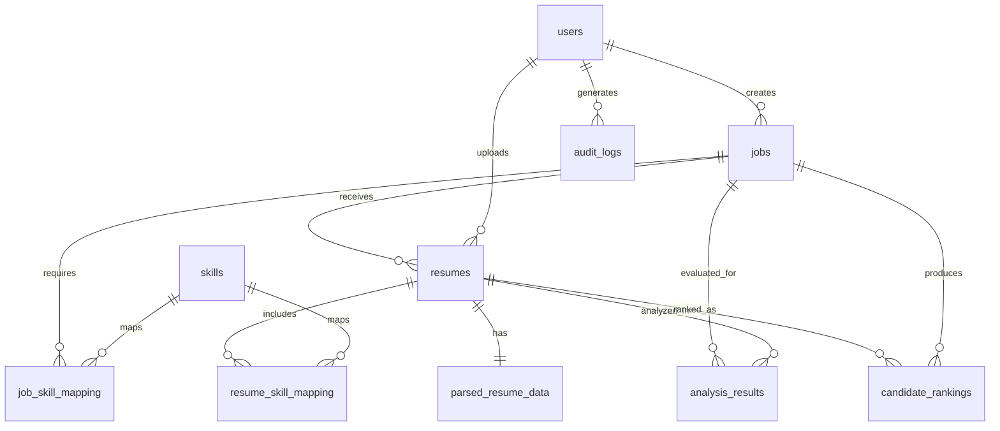

# DBMS Design

## ER Diagram



## Normalization

- 1NF: every table stores atomic values only; repeating skill values are separated into `skills`, `resume_skill_mapping`, and `job_skill_mapping`.
- 2NF: non-key attributes depend on the full primary key; many-to-many relationships are separated into mapping tables.
- 3NF: transitive dependencies are removed; candidate details live in `parsed_resume_data`, ranking output lives in `candidate_rankings`, and audit metadata lives in `audit_logs`.

## Primary and Foreign Keys

- `users.id` is referenced by `jobs.created_by`, `resumes.uploaded_by`, and `audit_logs.user_id`.
- `jobs.id` is referenced by `resumes.job_id`, `job_skill_mapping.job_id`, `analysis_results.job_id`, and `candidate_rankings.job_id`.
- `resumes.id` is referenced by `parsed_resume_data.resume_id`, `resume_skill_mapping.resume_id`, `analysis_results.resume_id`, and `candidate_rankings.resume_id`.
- `skills.id` is referenced by `resume_skill_mapping.skill_id` and `job_skill_mapping.skill_id`.

## Indexing

- `idx_jobs_created_by` for recruiter dashboards.
- `idx_resumes_job_id` for job-linked upload fetches.
- `idx_analysis_results_job_score` for sorted results.
- `idx_candidate_rankings_job_rank` for leaderboard reads.
- `idx_audit_logs_entity` for audit trace lookups.

## Stored Procedure

- `refresh_candidate_rankings(job_id)` recalculates the leaderboard from `analysis_results` using `DENSE_RANK`.

## Trigger

- `trg_analysis_audit` writes a row into `audit_logs` every time a new `analysis_results` row is inserted.

## Example Joins

```sql
SELECT prd.candidate_name, ar.overall_score, ar.ats_score, j.title
FROM analysis_results ar
JOIN resumes r ON r.id = ar.resume_id
JOIN parsed_resume_data prd ON prd.resume_id = r.id
JOIN jobs j ON j.id = ar.job_id
WHERE j.id = 1
ORDER BY ar.overall_score DESC;
```

## Advanced SQL Queries

```sql
SELECT s.name, COUNT(*) AS frequency
FROM resume_skill_mapping rsm
JOIN skills s ON s.id = rsm.skill_id
JOIN resumes r ON r.id = rsm.resume_id
WHERE r.job_id = 1
GROUP BY s.name
ORDER BY frequency DESC;
```

```sql
SELECT prd.candidate_name, cr.rank_position, cr.overall_score
FROM candidate_rankings cr
JOIN resumes r ON r.id = cr.resume_id
JOIN parsed_resume_data prd ON prd.resume_id = r.id
WHERE cr.job_id = 1
ORDER BY cr.rank_position ASC;
```
